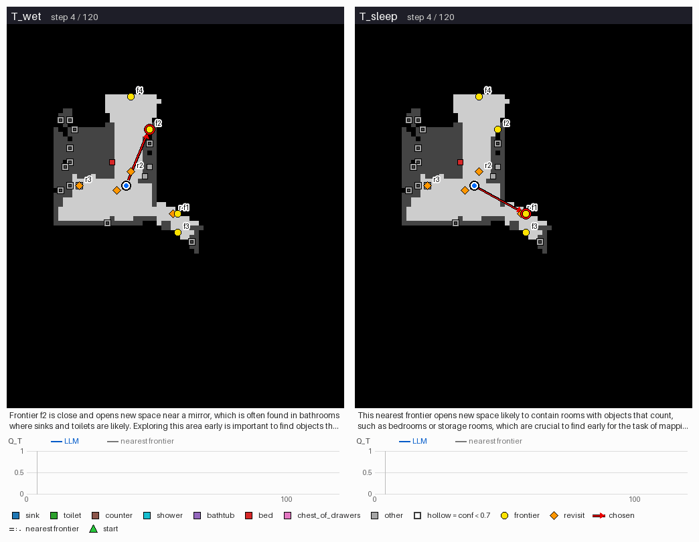
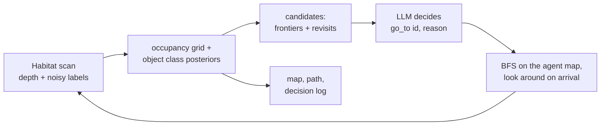

# Agentic mapping in simulation: an LLM agent decides where to explore and what to map (HM3D, Habitat)

I built a minimal version of an agentic mapping framework: input an unseen simulated environment, a step budget and a one-line task → an LLM agent decides where to go next and the system outputs the map it built, with its path and decision log.
The agent chooses between opening new space (frontiers) and going back to look closer at objects it is unsure about (revisits); it is evaluated against nearest-frontier exploration on a preregistered batch of held-out HM3D-Semantics scans.

> Application material for a semester project on *Agentic Mapping* (RAI Institute Zurich, Laurent Kneip and Abel Gawel), applied for through the *Embodied, Agentic AI* posting. Frozen snapshot, 2026-10-07.



*Held-out scene 00810, seed 1002 (picked by the preregistered GIF rule). Left: "wash hands or use the toilet"; right: "sleep or store clothes". Grey = mapped, black = unknown, squares = detected objects (hollow = not yet confident), yellow = frontiers, orange = revisit viewpoints, red arrow = the agent's choice, dashed = the nearest frontier; the text line is the agent's logged reason. Bottom: task map quality Q_T of the agent and of nearest-frontier exploration.*

**Results** (12 held-out val scenes never used for tuning × 2 tasks × 2 seeds = 48 runs): the agent beats nearest-frontier exploration by ≥ 0.10 in task map quality in **11/48** runs and falls behind by as much in **4/48**; the same agent given the other task does so in 7/48. Mean gain **+0.055** (scene-level 95% CI [+0.001, +0.119]). Task-dependent exploration order: **not shown** (0/24 scene-seeds). One preregistered batch, frozen configuration; every attempt is in `results/heldout_batch1_floor.json`, and a fresh GPU instance reproduces all 192 episodes exactly from this snapshot.

What is hard-coded: simulation only (habitat-sim on HM3D-Semantics scans), object labels are the scene annotations plus distance-dependent noise (no detector), ground-truth pose, noise-free depth, start floor only, doors open, frontier and revisit candidates and the BFS planner are scripted; the LLM picks every target.

**Stack**
- **Simulation:** habitat-sim 0.3.3 (headless) · HM3D-Semantics v0.2 · AWS g4dn.xlarge (T4)
- **Mapping:** depth → 2D occupancy grid · per-object Bayesian class posteriors under a calibrated noise model · Yamauchi-style frontiers · revisit viewpoints with line of sight · BFS on the agent's own map
- **Agent:** OpenAI tool calling (gpt-4.1-mini, forced `go_to(candidate, reason, predicted_beyond)`) · every call cached, replayable without a key
- **Evaluation:** preregistration with content hashes · held-out split · nearest-frontier, random and scripted baselines · scene-level bootstrap CI, Wilcoxon · meta-transform (truth-firewall) tests

## Project fit at a glance

| Listing goal (Agentic Mapping) | What this repository does | Status |
|---|---|---|
| An agentic framework that removes the human from the mapping loop | One command runs sense → map → candidates → LLM decision → move until the budget ends; no human input | done in simulation |
| **Select high-value exploration frontiers** with high-level reasoning | The LLM picks among frontiers with path costs; vs nearest-frontier on held-out scans: 11 better / 4 worse, mean +0.055 | done at prototype scale (small gain) |
| **Detect regions where mapping quality is deficient** | Revisit candidates for objects whose class posterior is below 0.7; on held-out scans 5 LLM revisits raised both the agent's confidence and the evaluator's correctness | done (rare events) |
| **Prioritize features for downstream tasks** | Task sentence and scored categories in the agent's input; the first confidently mapped task object did not follow the task (0/24) | not shown |
| Running directly on the target robot | Simulation stand-in; the agent and planner never read unobserved ground truth (meta-transform tests) | not done |

## Pipeline at a glance



Budget: 120 steps of 0.2 m, a 4-step look-around on arrival; decisions on arrival, when the target becomes invalid, and every 40 steps.

## Evidence snapshot

| finding | source |
|---|---|
| On held-out scans the agent is better than nearest-frontier by ≥ 0.10 in 11/48 runs, worse in 4/48; mean +0.055, CI [+0.001, +0.119], one-sided Wilcoxon p = 0.088 | `results/heldout_batch1_floor.json` |
| A scripted scorer with the same information does about as well (10 better / 2 worse, +0.033, CI [−0.003, +0.075]); random exploration is far worse (−0.108) | `results/heldout_batch1_floor.json` |
| The gain is mostly not task-specific: the agent run on the other task beats nearest-frontier in 7/48; cross-task specificity +0.026, CI [−0.004, +0.063] | `results/heldout_batch1_floor.json` |
| Revisits fix poorly mapped objects: 5 held-out revisits (with a frontier still open) raised the cluster's confidence and correctness | `results/heldout_batch1_floor.json` (`revisit_events`) |
| No ground-truth leak: hiding, moving or relabelling unobserved objects and rooms leaves the agent's inputs and route byte-identical | `tests/test_episode.py`, `tests/test_habitat.py` |
| Reproducible: a fresh AWS GPU instance, a fresh clone of this snapshot and no OpenAI key reproduce all 192 held-out episodes exactly | `scripts/replay_heldout.sh`, `eval/compare_replay.py` |
| Frozen before the held-out run (self-reported; this snapshot has no history) | `eval/prereg.json` |

## What this is not

- Not a real-robot result: everything runs in simulation, with ground-truth pose and annotated semantics instead of a detector.
- Not 3D mapping: the map is a top-down 2D occupancy grid with object labels.
- Not evidence that an LLM beats a task-aware heuristic, or that exploration adapts to the task: both were measured and not shown.
- Not a benchmark: one batch of 12 scenes, two tasks, two seeds.

## Quick start

**Local, seconds, no GPU** (Python 3.12, numpy, scipy, pillow): `python -m pytest -q` runs the core (map, candidates, planner, policies), full episodes on ProcTHOR 2D houses, the meta-transform tests and the preregistration checks. The Habitat tests skip without habitat-sim.

**Held-out replay, one command** (Linux, NVIDIA GPU, your own HM3D access; no OpenAI key):

```bash
bash scripts/setup_env.sh                       # pinned headless habitat-sim 0.3.3 environment -> env.sh
source env.sh
export AMAP_HM3D=$PWD/data/hm3d HM3D_TOKEN_ID=... HM3D_TOKEN_SECRET=...
bash scripts/fetch_heldout.sh                   # the 12 held-out val scenes only
bash scripts/replay_heldout.sh                  # 192 episodes from the committed LLM cache, compared with results/
```

The replay re-renders every observation on the GPU, answers every LLM call from `llm_cache/heldout_m.jsonl` and exits 0 only if all 192 episodes reproduce the committed scores exactly; each episode's map, path, decision log and metrics land in `out/heldout_m/replay/<scene>/<task>/s<seed>/<policy>/`. Tested on an AWS g4dn.xlarge (T4), 15 minutes.

**Judging:** `python -m eval.check_floor --root out/heldout_m/replay --prereg eval/prereg.json --tests-log <pytest -rA log>`. Two evaluator files changed after the run and differ from the hashes in `eval/prereg.json`: `eval/select_heldout.py` (a split option for a second batch that was never run) and `eval/check_floor.py` (two validations added by the post-run review; same report on batch 1).

## How it works

- **Sensing:** each step renders depth and semantics; depth within a height band gives the 2D scan; an instance with ≥ 50 pixels is a detection, labelled correctly with p = 0.9 / 0.65 / 0.55 within 1.5 / 3 / 4 m (wrong labels follow a frequency-preserving confusion matrix from a train-split class prior).
- **Map:** occupancy grid (unknown / free / occupied) plus a class posterior per object, fused with the same noise model; one close look makes an object confident (≥ 0.7).
- **Decision state** (the same for every policy): task sentence and scored categories, steps left, pose from the start, observed objects with tentative label and confidence, candidates with path steps and extra steps over the nearest frontier, the last 3 decisions. A revisit lists only the objects its look-around can settle.
- **Baselines** replace only the decision: nearest frontier (B1), random (B0), an evidence-gated script with the same category table (B2), and a ground-truth reference (REF, headroom estimate only).
- **Metric:** Q_T = (share of the cells within 1 m of task objects that are mapped + share of task objects labelled correctly and confidently) / 2 at the end of the budget. A run succeeds when Q_T(agent) − Q_T(B1) ≥ 0.10 with the same scene, task, seed, start and noise.
- **Tasks:** "Map the places where someone can wash their hands or use the toilet." (sink, toilet, shower, bathtub, counter) and "Map the places where someone can sleep or store clothes." (bed, chest of drawers, wardrobe).

## How the result was reached (all attempts reported)

| stage | scenes | agent vs nearest-frontier (better / worse) | outcome |
|---|---|---|---|
| Round 1, prompt v5 (tuning) | 12 train × 2 seeds | 5 / 10, mean −0.058 | the agent lost: it misread the task (cabinets, sofas) and revisited clutter before reaching the task rooms |
| Redesign: three independent proposals, offline replay of 159 logged decisions | — | v6 turned 66/75 premature revisits into frontier choices | prompt v6 and a decision state that states the scored categories and what a revisit can settle |
| Decision run, rule fixed in advance (`eval/stage1_rule.json`) | 12 fresh train × 2 seeds | v6: 7 / 1, mean +0.029 | gain not task-specific; the stop rule froze v6 |
| **Held-out batch 1** (`eval/prereg.json`) | 12 val × 2 seeds | **11 / 4**, mean +0.055 | frontier selection and revisits shown; task-dependent order not shown |
| Round 3 aimed at task adaptation (`eval/stage3_rule.json`) | 12 fresh train × 2 seeds | v7: 6 / 4 | rejected by its rule; no second held-out batch |

Seven prompt versions were written on train scenes (`prompts/`; version 2 kept the version 1 text and shortened the decision state); the task sentences predate all results. During the held-out run one API read timeout was logged as a crash; the fix and the single infrastructure rerun allowed by the plan are recorded in `eval/prereg.json` (`amendments`).

## Limitations and next steps

- At 120 steps nearest-frontier is a strong baseline, and much of the outcome is decided early: in 16 of 24 held-out scene-seeds the first task object was confirmed during the opening look-around, before any decision.
- Task adaptation is the missing capability. Next: let the agent decide at room level (which region to explore next, whether to finish a room) instead of per frontier, and test it on a fresh held-out batch.
- Then replace annotated semantics with an open-vocabulary detector on the RGB frames, and move to real data and a robot stack (scene graphs, ROS 2), which this prototype does not touch.

## Repo layout

| path | contents |
|---|---|
| `amap/` | sensing and noise model, agent map, candidates, planner, policies (LLM and baselines), episode loop, metrics, Habitat and ProcTHOR backends, GIF rendering |
| `eval/` | preregistration (`prereg.json`), held-out selection, freeze step, floor judge, decision rules |
| `configs/`, `prompts/` | every configuration and prompt version used |
| `scripts/` | environment setup, HM3D fetch, held-out replay |
| `results/`, `figures/`, `llm_cache/` | committed results, the GIF, cached LLM answers |
| `tests/`, `data/procthor/` | unit and episode tests, ProcTHOR houses for the CPU tests |

## Data, licences and references

This project uses the Habitat-Matterport 3D Research Dataset (HM3D) and HM3D-Semantics by Matterport, Inc., under the [Matterport End User License Agreement for Academic Use of Model Data](https://matterport.com/legal/matterport-end-user-license-agreement-academic-use-model-data). No HM3D data is included. The repository contains information derived from it for non-commercial academic use under that agreement: the agent's own 2D maps (the GIF), per-scene scores and scene ids (`results/`), category counts of 8 train scenes (`configs/prior_hm3d_train.json`) and the LLM's cached answers (`llm_cache/heldout_m.jsonl`, answers only, no prompts). ProcTHOR-10K houses (Apache-2.0, `data/procthor/LICENSE`) are used for the CPU tests.

- Ramakrishnan et al., *Habitat-Matterport 3D Dataset (HM3D): 1000 Large-scale 3D Environments for Embodied AI*, NeurIPS Datasets and Benchmarks 2021.
- Yadav et al., *Habitat-Matterport 3D Semantics Dataset*, CVPR 2023.
- Yamauchi, *A frontier-based approach for autonomous exploration*, CIRA 1997.
