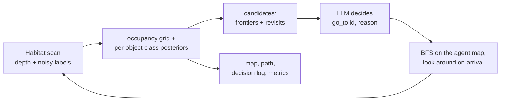

# Agentic mapping in simulation: an LLM agent decides where to explore and what to map

I built a minimal version of an agentic mapping framework: input an unseen simulated environment, a step budget and a one-line task → an LLM agent decides where to go next and the system outputs the map it built, with its path and decision log.


*Held-out val scene 00810-CrMo8WxCyVb, seed 1002, the pair picked by the preregistered GIF rule (median gain among pairs where the agent succeeds in both tasks). Left: "wash hands or use the toilet"; right: "sleep or store clothes". Black = unknown, grey = mapped, squares = detected objects (hollow = confidence < 0.7), yellow = frontiers, orange = revisit viewpoints, red arrow = the agent's choice, dashed = the nearest frontier; the text line is the agent's logged reason. The curves compare Q_T with the nearest-frontier baseline (B1). Only the agent's own map is shown, no rendered images.*

**Result (held-out batch 1, preregistered, frozen configuration).** On 12 HM3D-Semantics val scenes never used for tuning × 2 tasks × 2 seeds (48 attempts, B = 120 steps), the LLM agent's task map quality Q_T exceeded the nearest-frontier baseline by at least 0.10 in **11/48** attempts and fell short by as much in 4; the task-swap null (the same agent run on the other task, scored on this one) reaches 7/48. Mean difference **+0.055**, scene-level bootstrap 95% CI **[+0.001, +0.119]**, one-sided Wilcoxon p = 0.088. A scripted scorer with the same information (B2) gets 10/48 (lags 2), mean +0.033 [−0.003, +0.075]; random (B0) −0.108. **Showcase floor: 4 of 5 items met; the task-dependent exploration order (F2) was not shown.** Held-out batches used: 1.

| | what it means |
|---|---|
| Supported | On unseen scans the frozen LLM agent maps the task-relevant regions better than nearest-frontier exploration on average (CI excludes 0, narrowly). It revisits uncertain task objects and the revisit raises both its confidence and the evaluator's correctness (5 such events). Neither the agent nor the planner reads unobserved ground truth (meta-transform tests). |
| Not supported | That the exploration order adapts to the task: the first confidently mapped task object did not differ by task in any of the 24 held-out scene-seeds (in 16 of them it was fixed by the opening look-around, before any decision), and cross-task specificity S_h = +0.026 [−0.004, +0.063]. That an LLM beats a task-aware heuristic: B2's CI overlaps. Anything about real robots, 3D reconstruction or perception (see below). |

## What is real, what is simulated or hard-coded

- **Real:** HM3D-Semantics v0.2 scans rendered by headless habitat-sim 0.3.3 on an AWS GPU (T4); depth gives a 2D occupancy scan per step; the LLM (gpt-4.1-mini-2025-04-14, forced tool call) picks every target; every call is cached and replayable.
- **Simulated:** semantics are the scene annotations plus distance-dependent label noise (right with p = 0.9 / 0.65 / 0.55 within 1.5 / 3 / 4 m; wrong labels follow a frequency-preserving confusion matrix from a train-split class prior), not a detector. Depth and occupancy are noise-free, the pose is ground truth, only the start floor is used, doors are open.
- **Hard-coded:** the candidate generator (frontiers + revisit viewpoints), the BFS planner on the agent's own map, the step accounting (0.2 m per step, 4-step look-around on arrival), the task → category table that defines the score (and that B2 and, since prompt v6, the agent are given).

## How it works



- **Decision state:** task line and scored categories, steps left, pose from the start, observed objects (tentative label, confidence; objects of scored categories marked), candidates with path steps and extra steps over the nearest frontier, the last 3 decisions. A revisit lists only the objects its look-around can settle (within 1.5 m with line of sight on the agent map). Decisions on arrival, when the target becomes invalid, and every 40 steps.
- **Baselines** replace only the decision: B1 nearest frontier (then nearest revisit), B0 random, B2 evidence-gated script (stays with B1 unless a candidate is near objects labelled with a scored category; λ = 0.12 from a 9-point grid), REF reads ground truth (headroom estimate only).
- **Metric:** R_T = start-floor cells within 1 m of a ground-truth object of the task's categories; Q_T = (share of R_T observed + share of task objects labelled correctly with confidence ≥ 0.7) / 2 at the end of the budget. A run succeeds when Q_T(LLM) − Q_T(B1) ≥ 0.10 with the same scene, task, seed, start and noise.
- **Tasks:** "Map the places where someone can wash their hands or use the toilet." (sink, toilet, shower, bathtub, counter) and "Map the places where someone can sleep or store clothes." (bed, chest of drawers, wardrobe).

## How the result was reached (all attempts reported)

| stage | scenes | LLM vs B1 (lead / lag) | outcome |
|---|---|---|---|
| Round 1, prompt v5 (tuning) | 12 train × 2 seeds | 5 / 10, mean −0.058 | the agent lost to nearest-frontier: it misread the task (cabinets, sofas) and spent pre-room steps on revisits of clutter |
| Redesign: 3 independent proposals, offline replay of 159 logged decisions | — | v6 turned 66/75 premature revisits into frontier choices (categories alone: 27/75) | prompt v6 + a rendering that states the scored categories and what a revisit can settle |
| Decision boot, preregistered rule (`eval/stage1_rule.json`) | 12 fresh train × 2 seeds | v6: 7 / 1, mean +0.029, CI [+0.009, +0.056]; task-swap 6 / 0 | gain not task-specific, rule not met; the stop rule froze v6 |
| **Held-out batch 1** (`eval/prereg.json`) | 12 val × 2 seeds | **11 / 4**, mean +0.055, CI [+0.001, +0.119] | floor F1, F3, F4, F5 met; **F2 not met** |
| Round 3 aimed at F2, preregistered rule (`eval/stage3_rule.json`) | same 12 fresh train | v7: 6 / 4, F2 1 pass / 2 reverse (v6: 2 / 2) | not adopted; no further held-out batch |

Process facts: 7 prompt versions were written on train scenes (the plan allowed 4; versions 5–7 were approved by the author, v7 was rejected by its rule); B2 had 18 grid points over two forms; the task sentences predate all results, the categories follow them; the predictions in `eval/prereg.json` were drafted on the author's instruction and approved before the held-out selection. During the held-out run one API read timeout was logged as a crash (Python 3.9's `socket.timeout` escaped the retry loop); the fix and the single infrastructure rerun allowed by the plan were recorded as an amendment in `eval/prereg.json` and committed before the rerun.

## Showcase floor (held-out batch 1)

| item | result |
|---|---|
| F1 ≥ 3 successes on ≥ 3 scenes, both tasks | met: 11 successes on 7 scenes, both tasks |
| F2 first confidently mapped task object follows the task in ≥ 1 scene-seed | **not met**: 0 / 24 |
| F3 a non-fallback LLM revisit with a frontier still open raises the cluster's confidence and correctness | met: 5 events |
| F4 meta-transform tests (unobserved categories, unseen geometry and rooms leave inputs and route byte-identical) | met |
| F5 every grid cell has exactly one finished run (192 / 192), all attempts listed | met (`results/heldout_batch1_floor.json`) |

Preregistered predictions: P1 (the LLM leads more often than it lags) held; P2 (successes at most 3 above its own task-swap null) did not (11 vs 7); P3 (at most 6 lags) held.

## Reproduce

**Local, seconds, no GPU:** `python -m pytest -q` runs the core (map, candidates, planner, policies), full episodes on ProcTHOR 2D houses, the meta-transform tests and the preregistration checks. The Habitat tests skip without habitat-sim.

**Held-out replay, one command (Linux, NVIDIA GPU, your own HM3D access; no OpenAI key):**

```bash
bash scripts/setup_env.sh                       # pinned headless habitat-sim 0.3.3 environment -> env.sh
source env.sh
export AMAP_HM3D=$PWD/data/hm3d HM3D_TOKEN_ID=... HM3D_TOKEN_SECRET=...
bash scripts/fetch_heldout.sh                   # the 12 held-out val scenes only
bash scripts/replay_heldout.sh                  # 192 episodes from the committed LLM cache, compared with results/
```

The replay re-renders every observation on the GPU, answers every LLM call from `llm_cache/heldout_m.jsonl` and exits 0 only if all 192 episodes reproduce the committed scores exactly; each episode's map, path, decision log and metrics land in `out/heldout_m/replay/<scene>/<task>/s<seed>/<policy>/`. Tested on an AWS g4dn.xlarge (T4).

**Judging:** `python -m eval.check_floor --root out/heldout_m/replay --prereg eval/prereg.json --tests-log <pytest -rA log>`. The preregistration was committed before the held-out run (self-reported: this repository is a snapshot without history); `eval/prereg.json` sha256 `ea734b019d6079fa7e81490e89b4ba02af5a64a6ecedc1273ee61b98e72159aa`. Two evaluator files changed after the run and differ from the hashes recorded there: `eval/select_heldout.py` (a split option for a second batch that was never run) and `eval/check_floor.py` (two validations added by the post-run review; it gives the same report on batch 1).

## Limits and next steps

- The success criterion compares end-of-budget map quality; at B = 120 nearest-frontier is a strong baseline and much of the outcome is decided early (the opening look-around fixed the first task object in 16/24 held-out scene-seeds).
- Task adaptation is the missing capability. Next: let the agent decide at room granularity (which region to explore next, whether to sweep a room) instead of per frontier, and test it on a fresh held-out batch.
- Semantics come from annotations plus noise; a natural next step is an open-vocabulary detector on the RGB frames, then real data and the robot stack (Hydra, ROS 2), which this prototype does not touch.

## Data and licences

This project uses the Habitat-Matterport 3D Research Dataset (HM3D) and HM3D-Semantics by Matterport, Inc., under the [Matterport End User License Agreement for Academic Use of Model Data](https://matterport.com/legal/matterport-end-user-license-agreement-academic-use-model-data). No HM3D data is included. The repository contains information derived from it for non-commercial academic use under that agreement: the agent's own 2D maps (the GIF), per-scene scores and scene ids (`results/`), category counts of 8 train scenes (`configs/prior_hm3d_train.json`) and the LLM's cached answers (`llm_cache/heldout_m.jsonl`, answers only, no prompts).

- Ramakrishnan et al., *Habitat-Matterport 3D Dataset (HM3D): 1000 Large-scale 3D Environments for Embodied AI*, NeurIPS Datasets and Benchmarks 2021.
- Yadav et al., *Habitat-Matterport 3D Semantics Dataset*, CVPR 2023.

ProcTHOR-10K houses (Apache-2.0, `data/procthor/LICENSE`) are used for the CPU tests.
